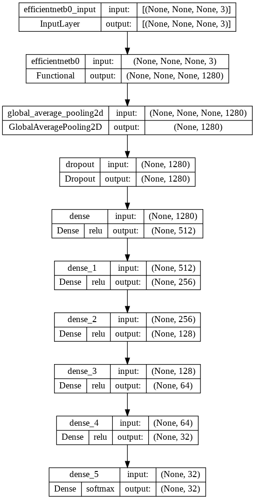

Implementing Multiple Deep Learning Architectures on the zArASL_Database_54K Dataset
==============================
This is a submission of **Second Assignment** for the **CIS735** course.

It contains the code necessary to implement multiple deep learning architectures for the zArASL_Database_54K multiclass
image classification problem.

The dataset from the [zArASL_Database_54K](https://www.kaggle.com/datasets/zssash/zarasl-database-54k) has been used.

Getting Started
------------
Clone the project from GitHub

`$ git clone https://github.com/tariqshaban/arabic-sign-language-image-classification.git`

No further configuration is required.


Usage
------------
Navigate to the bottom of the notebook and specify the following hyperparameters:

* Seed
* Neural network type:
    * Fully connected neural network (FCNN)
    * Convolutional neural network (CNN)
    * Convolutional neural network (CNN) using a pretrained model (transfer learning on the EfficientNetB0 architecture)
* Generic network size:
    * Nano
    * Micro
    * Small
* Activation function type:
    * Sigmoid
    * Tanh
    * ReLU
    * Leaky ReLU
* Optimizer
    * Stochastic gradient descent (SGD)
    * Root Mean Squared Propagation (RMSProp)
    * Adam
* Number of epochs \[1, 100\]
* Early stopping value

> **Warning**: Even though specifying the seed should ensure reproducible results, the kernel must be reset after
> finishing a single model

> **Warning**: The seed is ineffective if the running machine is different, or if the runtime was switched between CPU
> and GPU

> **Note**: The learning rate field was discarded since the optimizer's default value usually yields better results


Invoke the following methods:

``` python
# Ready the dataset and partition it into training, validation, and testing folders
prime_dataset()

# Conducts preliminary exploration methods
# :param bool show_dataframe: Specify whether to show the classes dataframe or not
# :param bool show_image_sample: Specify whether to display a sample image from each class or not
# :param bool show_class_distribution: Specify whether to plot the distribution of each class with respect to its train/valid/test partitioning
explore_dataset(show_dataframe: bool = True, show_image_sample: bool = True, show_class_distribution: bool = True)

# Builds the model, and returns the fitted object
# :param bool plot_network: Specify whether to visually plot the neural network or not
# :param bool measure_performance: Specify whether to carry out the evaluation metrics on the created model (shows loss/accuracy trend across epochs and displays a confusion matrix on the test set)
build_model(plot_network: bool = True, measure_performance: bool = True)
```

Methodology
------------

> ### Dataset Exploration
>
> --------
>
> The following is a table denotes the classes of the dataset (sorted alphabetically based on the ClassAr column).
>
> Note that a total of 32 classes can be observed from the table.
>
> | ClassId | Class | ClassAr |
> |:-------:|:-----:|:-------:|
> |  29    |  ya   |    ئ    |
> |   1    |  al   |   ال    |
> |   2    | aleff |   الف   |
> |   3    |  bb   |   باء   |
> |  27    | toot  |    ة    |
> |  24    |  taa  |   تاء   |
> |  25    | thaa  |   ثاء   |
> |  12    | jeem  |   جيم   |
> |  11    |  haa  |   حاء   |
> |  14    | khaa  |   خاء   |
> |   4    |  dal  |   دال   |
> |  26    | thal  |   ذال   |
> |  19    |  ra   |   راء   |
> |  31    |  zay  |   زاي   |
> |  21    | seen  |   سين   |
> |  22    | sheen |   شين   |
> |  20    | saad  |   صاد   |
> |   6    | dhad  |   ضاد   |
> |  23    |  ta   |   طاء   |
> |   5    |  dha  |   ظاء   |
> |   0    |  ain  |   عين   |
> |   9    | ghain |   غين   |
> |   7    |  fa   |   فاء   |
> |   8    | gaaf  |   قاف   |
> |  13    | kaaf  |   كاف   |
> |  15    |  la   |   لا    |
> |  16    | laam  |   لام   |
> |  17    | meem  |   ميم   |
> |  18    |  nun  |   نون   |
> |  10    |  ha   |   هاء   |
> |  28    |  waw  |   واو   |
> |  30    |  yaa  |   ياء   |
>
> The figure below displays an image from each class:
>
> 
>
> The image displays how well the classes are balanced, note that `(ain) عين` has approximately 700 more images
> than `(yaa) ياء`.
>
> 

> ### Dataset Preprocessing
>
> --------
>
> * No significant image processing techniques have been carried out
> * All images have the same size (64x64x3)
> * Image rescaling technique has been used (pixel normalization)
>
> > **Note**: In transfer learning architectures, image rescaling was omitted since the EfficientNetB0 network already
> > contains a normalization layer
>
> > **Note**: In transfer learning architectures, image resolution is upscaled to (256, 256); in order to comply with
> > the EfficientNetB0 input specifications

> ### Models Construction
>
> --------
>
> As previously stated, below are the generic network sizes that are enforced on all neural networks in this repository:
>   * Nano
>   * Micro
>   * Small
>
> The leveraged neural networks:
>   * Fully connected neural network (FCNN)
>   * Convolutional neural network (CNN)
>   * Convolutional neural network (CNN) using a pretrained model
>
> The following images display the affect of each network size on the architecture of each neural network:
>
> <table>
>    <tr>
>       <th colspan="2">Fully Connected Neural Network (FCNN)</th>
>    </tr>
>    <tr>
>       <td align="center">Nano</td>
>    </tr>
>    <tr>
>       <td></td>
>    </tr>
>    <tr>
>       <td align="center">Micro</td>
>    </tr>
>    <tr>
>       <td></td>
>    </tr>
>    <tr>
>       <td align="center">Small</td>
>    </tr>
>    <tr>
>       <td></td>
>    </tr>
> </table>
>
> <table>
>    <tr>
>       <th colspan="2">Convolutional Neural Network (CNN)</th>
>    </tr>
>    <tr>
>       <td align="center">Nano</td>
>    </tr>
>    <tr>
>       <td></td>
>    </tr>
>    <tr>
>       <td align="center">Micro</td>
>    </tr>
>    <tr>
>       <td></td>
>    </tr>
>    <tr>
>       <td align="center">Small</td>
>    </tr>
>    <tr>
>       <td></td>
>    </tr>
> </table>
>
> <table>
>    <tr>
>       <th colspan="2">Convolutional Neural Network (CNN) w/ Transfer Learning</th>
>    </tr>
>    <tr>
>       <td align="center">Nano</td>
>    </tr>
>    <tr>
>       <td></td>
>    </tr>
>    <tr>
>       <td align="center">Micro</td>
>    </tr>
>    <tr>
>       <td></td>
>    </tr>
>    <tr>
>       <td align="center">Small</td>
>    </tr>
>    <tr>
>       <td></td>
>    </tr>
> </table>


Findings
------------

### FCNN

<table>
<thead>
  <tr>
    <th colspan="2"></th>
    <th colspan="2">Nano</th>
    <th colspan="2">Micro</th>
    <th colspan="2">Small</th>
  </tr>
  <tr>
    <th>Activation</th>
    <th>Optimizer</th>
    <th>Accuracy</th>
    <th>Loss</th>
    <th>Accuracy</th>
    <th>Loss</th>
    <th>Accuracy</th>
    <th>Loss</th>
  </tr>
</thead>
<tbody>
  <tr>
    <th rowspan="3">Sigmoid</th>
    <th>SGD</th>
    <td>%29.00</td>
    <td>2.6779</td>
    <td>%5.170</td>
    <td>3.4457</td>
    <td>%3.92</td>
    <td>3.4597</td>
  </tr>
  <tr>
    <th>RMSProp</th>
    <td>%36.90</td>
    <td>2.1605</td>
    <td>%39.33</td>
    <td>1.9779</td>
    <td>%27.71</td>
    <td>2.3854</td>
  </tr>
  <tr>
    <th>Adam</th>
    <td>%18.75</td>
    <td>2.8965</td>
    <td>%20.55</td>
    <td>2.8522</td>
    <td>%3.92</td>
    <td>3.4603</td>
  </tr>
  <tr>
    <th rowspan="3">Tanh</th>
    <th>SGD</th>
    <td>%49.32</td>
    <td>1.8810</td>
    <td>%66.83</td>
    <td>1.2045</td>
    <td>%73.47</td>
    <td>0.8914</td>
  </tr>
  <tr>
    <th>RMSProp</th>
    <td>%26.22</td>
    <td>2.5885</td>
    <td>%30.38</td>
    <td>2.3663</td>
    <td>%7.32</td>
    <td>3.2007</td>
  </tr>
  <tr>
    <th>Adam</th>
    <td>%3.40</td>
    <td>3.4650</td>
    <td>%14.46</td>
    <td>3.0153</td>
    <td>%3.49</td>
    <td>3.4675</td>
  </tr>
  <tr>
    <th rowspan="3">ReLU</th>
    <th>SGD</th>
    <td>%54.92</td>
    <td>1.5363</td>
    <td>%70.84</td>
    <td>0.9636</td>
    <td>%50.19</td>
    <td>1.7976</td>
  </tr>
  <tr>
    <th>RMSProp</th>
    <td>%3.92</td>
    <td>3.4597</td>
    <td>%3.92</td>
    <td>3.4597</td>
    <td>%3.92</td>
    <td>3.4597</td>
  </tr>
  <tr>
    <th>Adam</th>
    <td>%3.92</td>
    <td>3.4597</td>
    <td>%83.26</td>
    <td>0.6132</td>
    <td>%3.92</td>
    <td>3.4597</td>
  </tr>
  <tr>
    <th rowspan="3">Leaky Relu</th>
    <th>SGD</th>
    <td>%53.35</td>
    <td>1.6143</td>
    <td>%67.84</td>
    <td>1.0764</td>
    <td>%74.21</td>
    <td>0.8452</td>
  </tr>
  <tr>
    <th>RMSProp</th>
    <td>%51.77</td>
    <td>1.5967</td>
    <td>%55.16</td>
    <td>1.8461</td>
    <td>%76.97</td>
    <td>0.7628</td>
  </tr>
  <tr>
    <th>Adam</th>
    <td>%67.73</td>
    <td>1.1280</td>
    <td>&#9989;%84.50</td>
    <td>&#9989;0.5878</td>
    <td>%84.22</td>
    <td>0.5939</td>
  </tr>
</tbody>
</table>

### CNN

<table>
<thead>
  <tr>
    <th colspan="2"></th>
    <th colspan="2">Nano</th>
    <th colspan="2">Micro</th>
    <th colspan="2">Small</th>
  </tr>
  <tr>
    <th>Activation</th>
    <th>Optimizer</th>
    <th>Accuracy</th>
    <th>Loss</th>
    <th>Accuracy</th>
    <th>Loss</th>
    <th>Accuracy</th>
    <th>Loss</th>
  </tr>
</thead>
<tbody>
  <tr>
    <th rowspan="3">Sigmoid</th>
    <th>SGD</th>
    <td>%3.92</td>
    <td>3.4587</td>
    <td>%3.92</td>
    <td>3.4527</td>
    <td>%4.58</td>
    <td>3.4398</td>
  </tr>
  <tr>
    <th>RMSProp</th>
    <td>%2.90</td>
    <td>8.5300</td>
    <td>%5.48</td>
    <td>4.8434</td>
    <td>%12.00</td>
    <td>7.3554</td>
  </tr>
  <tr>
    <th>Adam</th>
    <td>%6.29</td>
    <td>4.902</td>
    <td>%6.53</td>
    <td>9.1905</td>
    <td>%18.18</td>
    <td>5.5146</td>
  </tr>
  <tr>
    <th rowspan="3">Tanh</th>
    <th>SGD</th>
    <td>%4.58</td>
    <td>4.6877</td>
    <td>%14.13</td>
    <td>3.1408</td>
    <td>%88.84</td>
    <td>0.4504</td>
  </tr>
  <tr>
    <th>RMSProp</th>
    <td>%7.65</td>
    <td>6.9120</td>
    <td>%19.38</td>
    <td>6.1763</td>
    <td>%87.74</td>
    <td>0.4868</td>
  </tr>
  <tr>
    <th>Adam</th>
    <td>%7.45</td>
    <td>7.2570</td>
    <td>%31.41</td>
    <td>4.4689</td>
    <td>%76.34</td>
    <td>0.9064</td>
  </tr>
  <tr>
    <th rowspan="3">ReLU</th>
    <th>SGD</th>
    <td>%10.23</td>
    <td>3.6544</td>
    <td>%59.78</td>
    <td>1.1868</td>
    <td>%96.77</td>
    <td>0.1303</td>
  </tr>
  <tr>
    <th>RMSProp</th>
    <td>%15.16</td>
    <td>7.1755</td>
    <td>%38.74</td>
    <td>4.7649</td>
    <td>%88.93</td>
    <td>0.4513</td>
  </tr>
  <tr>
    <th>Adam</th>
    <td>%15.51</td>
    <td>9.1730</td>
    <td>%87.02</td>
    <td>0.4670</td>
    <td>%95.12</td>
    <td>0.2065</td>
  </tr>
  <tr>
    <th rowspan="3">Leaky Relu</th>
    <th>SGD</th>
    <td>%10.08</td>
    <td>4.4987</td>
    <td>%38.68</td>
    <td>2.5518</td>
    <td>%96.35</td>
    <td>0.1434</td>
  </tr>
  <tr>
    <th>RMSProp</th>
    <td>%9.51</td>
    <td>14.118</td>
    <td>%84.24</td>
    <td>0.6299</td>
    <td>%94.49</td>
    <td>0.2322</td>
  </tr>
  <tr>
    <th>Adam</th>
    <td>%11.31</td>
    <td>8.1749</td>
    <td>%52.73</td>
    <td>2.8816</td>
    <td>&#9989;%98.03</td>
    <td>&#9989;0.1078</td>
  </tr>
</tbody>
</table>

### CNN w/ Transfer Learning

<table>
<thead>
  <tr>
    <th colspan="2"></th>
    <th colspan="2">Nano</th>
    <th colspan="2">Micro</th>
    <th colspan="2">Small</th>
  </tr>
  <tr>
    <th>Activation</th>
    <th>Optimizer</th>
    <th>Accuracy</th>
    <th>Loss</th>
    <th>Accuracy</th>
    <th>Loss</th>
    <th>Accuracy</th>
    <th>Loss</th>
  </tr>
</thead>
<tbody>
  <tr>
    <th rowspan="3">Sigmoid</th>
    <th>SGD</th>
    <td>%56.83</td>
    <td>1.8929</td>
    <td>%3.92</td>
    <td>3.4471</td>
    <td>%3.92</td>
    <td>3.4597</td>
  </tr>
  <tr>
    <th>RMSProp</th>
    <td>%93.52</td>
    <td>0.2538</td>
    <td>%94.77</td>
    <td>0.2047</td>
    <td>%95.71</td>
    <td>0.1624</td>
  </tr>
  <tr>
    <th>Adam</th>
    <td>%93.55</td>
    <td>0.2537</td>
    <td>%95.01</td>
    <td>0.1874</td>
    <td>%96.28</td>
    <td>0.1377</td>
  </tr>
  <tr>
    <th rowspan="3">Tanh</th>
    <th>SGD</th>
    <td>%76.05</td>
    <td>0.8074</td>
    <td>%83.94</td>
    <td>0.6029</td>
    <td>%86.61</td>
    <td>0.5011</td>
  </tr>
  <tr>
    <th>RMSProp</th>
    <td>%94.11</td>
    <td>0.2150</td>
    <td>%96.46</td>
    <td>0.1321</td>
    <td>%96.42</td>
    <td>0.1200</td>
  </tr>
  <tr>
    <th>Adam</th>
    <td>%94.14</td>
    <td>0.2163</td>
    <td>%96.15</td>
    <td>0.1356</td>
    <td>%96.39</td>
    <td>0.1182</td>
  </tr>
  <tr>
    <th rowspan="3">ReLU</th>
    <th>SGD</th>
    <td>%83.98</td>
    <td>0.5926</td>
    <td>%85.64</td>
    <td>0.4804</td>
    <td>%89.76</td>
    <td>0.3596</td>
  </tr>
  <tr>
    <th>RMSProp</th>
    <td>%94.62</td>
    <td>0.1921</td>
    <td>%96.53</td>
    <td>0.1130</td>
    <td>&#9989;%97.29</td>
    <td>0.0907</td>
  </tr>
  <tr>
    <th>Adam</th>
    <td>%94.60</td>
    <td>0.1956</td>
    <td>%96.63</td>
    <td>0.1154</td>
    <td>%97.14</td>
    <td>&#9989;0.0883</td>
  </tr>
  <tr>
    <th rowspan="3">Leaky Relu</th>
    <th>SGD</th>
    <td>%84.41</td>
    <td>0.5792</td>
    <td>%87.04</td>
    <td>0.4233</td>
    <td>%90.44</td>
    <td>0.3406</td>
  </tr>
  <tr>
    <th>RMSProp</th>
    <td>%94.68</td>
    <td>0.1906</td>
    <td>%96.57</td>
    <td>0.1184</td>
    <td>%97.18</td>
    <td>0.0922</td>
  </tr>
  <tr>
    <th>Adam</th>
    <td>%94.58</td>
    <td>0.1974</td>
    <td>%96.20</td>
    <td>0.1280</td>
    <td>%97.01</td>
    <td>0.1045</td>
  </tr>
</tbody>
</table>

> ### Model Performance
>
> --------
>
> The following images are the result of using the following hyperparameters (one of the hyperparameters that yielded
> the highest results):
>   * Seed: 42
>   * Network Type: CNN w/ transfer learning (EfficientNetB0)
>   * Network Size: small, see `Models Construction` section for exact architecture
>   * Activation function: ReLU (used in dense layers appended to the base model)
>   * Optimizer: Adam
>   * Epochs: 30
>   * Early stopping: upon 10 epochs
>
> 
>
> Notice that the accuracy converged rapidly, and stabilized at approximately the 20ᵗʰ epoch, this indicates that the
> number of epochs is sufficient for this given model.
>
> 
>
> Similarly, the model was able to converge quickly when inspecting the loss plot
>
> 
>
> Based on the confusion matrix, the model was effective in discriminating between Arabic letters represented by sign
> language, almost all the test set entries reside on the diagonal.

Assignment Related Questions
------------

> **Note**: Each activation function has its own case, generally assuming an activation function to be poor might not be
> a good practice

> **Note**: It appears that different combinations of hyperparameters yield different results (e.g. Adam optimizer
> performed well on most networks, but it returns suboptimal results when paired with Sigmoid and Tanh for the FCNN
> architecture)

> **Note**: These observations are strictly bounded to the dataset and should not be generalized. Such observations can
> be easily contradicted when altering a hyperparameter

> #### Assess the impact of the activation function (Sigmoid, Tanh, ReLU, Leaky ReLU) on the accuracy, loss
>
> --------
>
> The impact of each activation function cannot be easily determined, several variables can affect the behaviour of the
> activation function.
>
> * Sigmoid: 
>   * Computationally expensive
>   * Complex derivative calculations due to the exponent
>   * Flattened ends on both sides cause saturation, saturation causes vanishing gradients
>   * Converges slowly
>   * Commonly used in binary classification
> * Tanh:
>   * Similar characteristics to the sigmoid
>   * Less computationally expensive than sigmoid (but still noticeable)
>   * Commonly used in NLP domains
> * ReLU:
>   * Well known
>   * Converges quickly
>   * Does not saturate easily
>   * Very simple formula, expedites the computation of the derivative
>   * Commonly used in the hidden layers of the FCNN
> * Leaky ReLU
>   * Similar characteristics to the sigmoid
>   * Further reduce the risk of saturation
> 
> Observations:
> * `ReLU` and `Leaky ReLU` Relu almost always had better results than `Sigmoid` and `Tanh` (sometimes by a large
    margin)
> * `Sigmoid` and `Tanh` often saturate; causing the training to stop early
> * If `Sigmoid` and `Tanh` were provided with more epochs, they might achieve results that compete with `ReLU`
>   and `Leaky ReLU`

> #### Assess the impact of the optimizer (SGD+ Momentum, Adam, RMSProp) on the accuracy, loss
>
> --------
> 
> Similarly to the previous question, the impact cannot be generalized, since the parameters of the optimizer can affect
> its behaviour.
>  
> Observations:
> * RMSProp and Adam obtained higher results than SGD in many cases
> * SGD takes longer time to converge, note that the learning rate default value for the SGD is ten higher than RMSProp
>   and Adam

> #### Assess the impact of the neural network depth on the accuracy, loss
>
> --------
> 
> While it seems from intuition that deeper neural networks should yield better results, it can cause, in some cases,
> the exact opposite effect. It may result in overfitting; making the test accuracy high but low on unseen data (such as
> validation and test sets). In addition, it may unnecessarily increase the number of parameters, which
> subsequently, increases the computational requirement.
>  
> Observations:
> * Deeper networks provide better results, but they can have a negative effect in some cases
> * Deeper networks can exhaust resources exponentially, especially the memory
> * Deeper networks should not be used to solve simple problems, this will cause the model to overfit

> #### Identify the factor which contributes to the model's overfitting
>
> --------
> 
> * Data has noise (outliers/errors); prevents the model from generalizing well
> * Data is not standardized (no regularization)
> * Model is too deep/complex
> * No dropout layers (for CNN architectures)
> * Training data is biased (the sample does not represent the population, or represents only a specific stratum)
> * No implementation of early stopping (prematurely stop the training when ***validation*** loss does not decrease for
    a predefined number of epochs)
> * Usage of SGD rather than RMSProp or Adam

Notes
------------

* Surprisingly, some fully connected networks achieved relatively acceptable results, this can be caused by the number
  of parameters for the image (64x64x3), FCNN is known to be a poor option when used solely on image problems; because
  unlike CNN, it lacks image feature extraction
* Transfer learning expedites the convergence, making it possible to achieve satisfactory results with only one digit
  epochs

--------